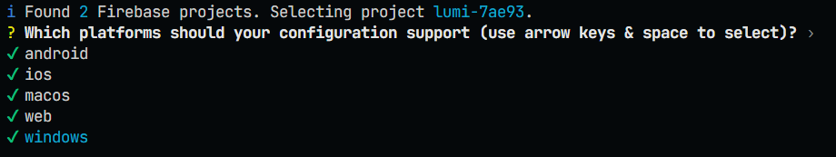

# 🚀 Lumi

Um aplicativo Flutter feito a partir do projeto ganhador do HackBarão 2025.

-----

## 🧩 Configuração do ambiente

### 1️⃣ Pré-requisitos

Certifique-se de ter instalado:

  - [Flutter SDK](https://flutter.dev/docs/get-started/install) **(3.22 ou superior)**
  - [Dart SDK](https://dart.dev/get-dart) *(já vem com o Flutter)*
  - [Firebase CLI](https://firebase.google.com/docs/cli)
  - [FlutterFire CLI](https://firebase.flutter.dev/docs/cli/)

Para instalar o FlutterFire CLI, execute no terminal:

```bash
dart pub global activate flutterfire_cli
```

### 2️⃣ Clonando o projeto

Clone o repositório e acesse o diretório do projeto:

```bash
git clone https://github.com/heratech-labs/lumi.git
cd lumi
flutter pub get
```

### 3️⃣ Configurando o Firebase

O projeto já está vinculado ao Firebase do Caio.

Cada desenvolvedor só precisa gerar seu próprio arquivo local de configuração para conectar ao mesmo projeto Firebase.
Execute:

```bash
flutterfire configure --project=lumi-7ae93
```

obs: SELECIONAR TODAS AS OPÇÕES DE DESENVOLVIMENTO!!!


### 4️⃣ Executando o app

Para rodar o aplicativo em modo debug:

```bash
flutter run
```

**Android:**
Certifique-se de ter um emulador Android aberto ou um dispositivo conectado via USB.

## 🔗 Recursos úteis

  - [☑ Guia de Desenvolvimento e Arquitetura](devGuide.md)
  - [Documentação FlutterFire](https://firebase.flutter.dev/docs/overview)
  - [Guia oficial Flutter](https://flutter.dev/docs)
  - [Firebase Console](https://console.firebase.google.com/)

Feito com 💙 pela equipe Lumi ✨
